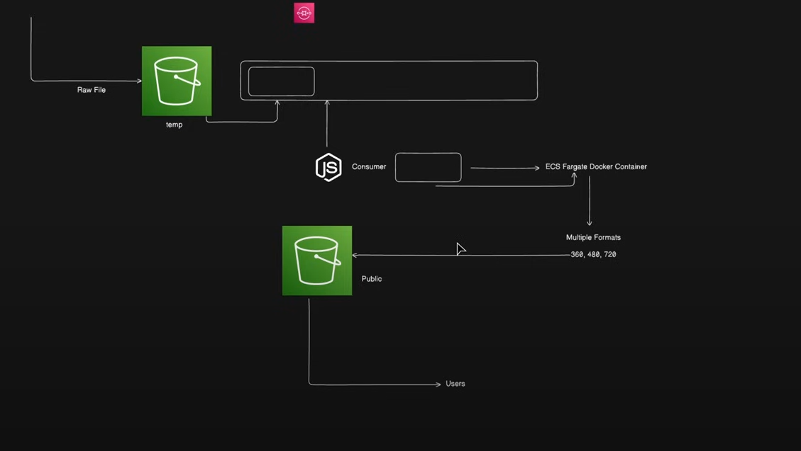

# Video Transcoding Pipeline

This repository contains three microservices for handling video transcoding tasks using AWS services. The services include:

1. **Transcoder Service**: Handles video transcoding from S3 and generates HLS output.
2. **Transcoder Consumer Service**: Pulls an SQS queue for video processing jobs and launches ECS tasks(if in SQS any event available and generate various version of the video using ffmpeg).
3. **Uploader Service**: Handles video uploads to S3 and provides a REST API for uploading video files.

## Architecture Diagram



## Prerequisites

Before running the services, ensure that the following tools and libraries are installed on your local environment:

- Node.js
- AWS SDK for Node.js
- Fluent-ffmpeg and ffmpeg-static for video transcoding
- S3, ECS, and SQS services
- Docker

## Services Overview

### 1. Transcoder Service

The **Transcoder Service** is responsible for:

- Downloading the original video file from the S3 bucket.
- Using FFmpeg to convert the video into multiple HLS (HTTP Live Streaming) resolutions.
- Generating master `.m3u8` playlist and uploading the transcoded output back to the production S3 bucket.

### 2. Transcoder Consumer Service

The **Transcoder Consumer Service** polls an SQS queue for messages that contain information about new video uploads. It:

- Reads messages from the SQS queue.
- Parses the video upload event and launches ECS tasks for video transcoding.
- Deletes the processed message from the SQS queue.

### 3. Uploader Service

The **Uploader Service** provides a simple API to upload videos to the S3 bucket:

- Accepts video files through HTTP requests.
- Uploads the files to S3.
- Includes a health check endpoint to monitor service health.

## Setup

1. **Clone the repository**:

   ```bash
   git clone https://github.com/Satyajit-Sahoo45/hls-video-transcoding-pipeline.git
   ```

2. **Install dependencies** for each service:

   - Navigate to the respective directories (`transcoder-service/`, `consumer-service/`, `uploader-service/`) and run:
     ```bash
     npm install
     ```

3. **Set up AWS Credentials**:
   Ensure that your AWS credentials are configured in `~/.aws/credentials` or provide them in the environment variables.

4. **Configure the environment variables** for each service.

## Usage

### Running Each Service

1. **Transcoder Service**:

   ```bash
   cd transcoder-service
   npm start
   ```

2. **Transcoder Consumer Service**:

   ```bash
   cd consumer-service
   npm start
   ```

3. **Uploader Service**:
   ```bash
   cd uploader-service
   npm start
   ```

## Environment Variables

Each service requires specific environment variables to be set. Below is the list of required environment variables for each service.

### Transcoder Service:

| Variable      | Description                                        |
| ------------- | -------------------------------------------------- |
| `BUCKET_NAME` | Name of the S3 bucket where the video is uploaded  |
| `KEY`         | S3 object key (video file path)                    |
| `PROD_BUCKET` | Production bucket where transcoded files are saved |

### Transcoder Consumer Service:

| Variable                | Description                                          |
| ----------------------- | ---------------------------------------------------- |
| `AWS_ACCESS_KEY_ID`     | AWS Access Key ID                                    |
| `AWS_SECRET_ACCESS_KEY` | AWS Secret Access Key                                |
| `QUEUE_URL`             | SQS queue URL to poll messages from                  |
| `CLUSTER_ARN`           | ARN of the ECS cluster for running transcoding tasks |
| `TASK_DEFINITION_ARN`   | ARN of the ECS task definition for transcoding       |

### Uploader Service:

| Variable                | Description                                |
| ----------------------- | ------------------------------------------ |
| `AWS_ACCESS_KEY_ID`     | AWS Access Key ID                          |
| `AWS_SECRET_ACCESS_KEY` | AWS Secret Access Key                      |
| `BUCKET_NAME`           | S3 bucket name for storing uploaded videos |

## API Endpoints

### Uploader Service:

1. **Upload Video**
   - **Endpoint**: `POST /upload`
   - **Description**: Uploads a video file to the S3 bucket.
   - **Request**:
     - Form Data: `file` (The video file to be uploaded)
   - **Response**:
     - Status `200`: Success message with the uploaded file details.
     - Status `400`: Error message if no file is uploaded.

## Deployment

You can deploy these services individually or as a whole system. For example, using Docker:

1. **Build Docker Images**:

   ```bash
   docker build -t transcoder-service ./transcoder-service
   docker build -t consumer-service ./consumer-service
   docker build -t uploader-service ./uploader-service
   ```

2. **Run Docker Containers**:

   ```bash
   docker run -p 3000:3000 transcoder-service
   docker run consumer-service
   docker run -p 3001:3001 uploader-service
   ```

3. **Deploy to ECS**:
   Create ECS task definitions and services for each microservice.
